<!--
## Hi there 👋

**sadbunnygit/sadbunnygit** is a ✨ _special_ ✨ repository because its `README.md` (this file) appears on your GitHub profile.

🔭 I’m currently working on... 
  - my personal portfolio: [sadbunnygit.github.io](sadbunnygit.github.io)
  - [my music machine manager](https://github.com/sadbunnygit/musicmachine)
-->

  
  
  

